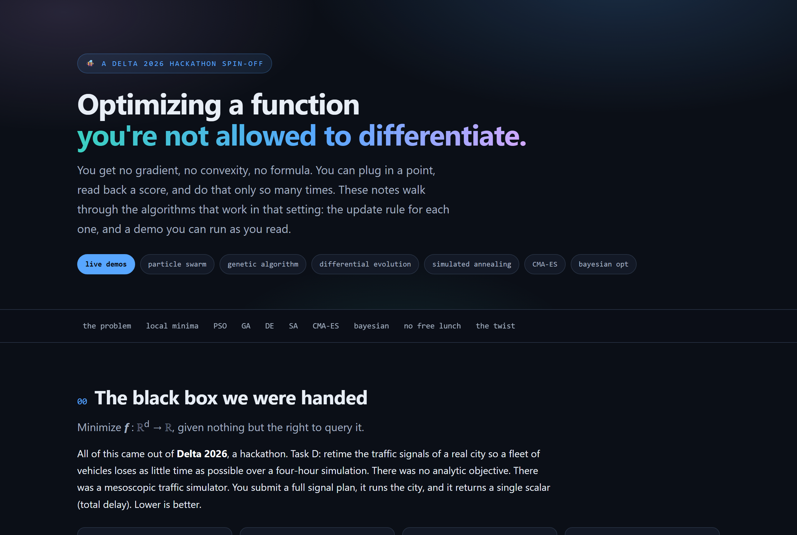

<div align="center">

# 🚦 without a gradient

### *Optimising a function you're not allowed to differentiate.*

A hands-on tour of black-box optimisation: seven metaheuristics, the theory behind
each one, and live demos you can drive in the browser. It grew out of a city
traffic problem at the **Delta 2026 hackathon**, which is also here, optimiser and
all.

**[▶ Open the explainer](https://rubendahan.github.io/without-a-gradient/)**  ·  **[▶ Try the Delta demo](https://rubendahan.github.io/without-a-gradient/delta/)**


<a href="https://rubendahan.github.io/without-a-gradient/">
  
</a>

</div>

## The idea

Sometimes you cannot differentiate the thing you want to minimise. There is no
formula, no convexity, maybe not even a stable value, just a box you can hand a
point and a number it hands back. Every query might be slow or noisy. A whole
family of algorithms is built for exactly that setting, and they all make the same
trade in different ways: explore the unknown, or refine the best thing found so
far.

This repo is three things in one:

- 🧠 **an explainer site** that teaches each method with typeset maths, hand-drawn
  figures, and canvas demos that run the real algorithm as you watch;
- 📦 **a small NumPy library** of the optimisers behind one consistent API;
- 🚦 **the Delta application**, the traffic-signal problem that started it, with an
  interactive optimiser and an honest finding.

## See it run

A few things worth a look on the [live explainer](https://rubendahan.github.io/without-a-gradient/):

- 🐝 **Particle swarm.** Push the inertia past 1 and the swarm refuses to settle;
  drop it and the whole flock collapses into the nearest basin.
- 🔥 **Simulated annealing.** Watch a single walker accept uphill moves while it is
  hot, then freeze into a valley as it cools.
- 🥚 **CMA-ES.** On a curved valley the sampling ellipse rotates and stretches until
  it lies along the floor, learning the landscape without a gradient.
- 📈 **Bayesian optimisation.** Step through one expensive evaluation at a time and
  see the surrogate decide where to look next.

Every demo runs the real algorithm on a canvas. Nothing is a recording.

## The library

Every optimiser minimises `f: ℝᵈ → ℝ` over a box and returns the same `Result`, so
swapping one for another is a one-line change.

```python
from metaheuristics import ParticleSwarm, CMAES, Bounds
from metaheuristics.benchmarks import rastrigin

bounds = Bounds(-5.12, 5.12, dim=10)

res = ParticleSwarm().minimize(rastrigin, bounds, seed=0)
print(res)            # Result(name='PSO', best_f=..., best_x=[...], n_evals=...)

res = CMAES().minimize(rastrigin, bounds, seed=0)   # same call, different engine
```

| Algorithm | Class | Best on |
|---|---|---|
| Particle Swarm | `ParticleSwarm`, `MultiSwarm` | multimodal, low effort |
| Genetic Algorithm | `GeneticAlgorithm` | rugged, multimodal |
| Differential Evolution | `DifferentialEvolution` | robust continuous default |
| Simulated Annealing | `SimulatedAnnealing` | escaping local minima cheaply |
| Hill Climbing (+ restarts) | `HillClimbing` | the honest baseline |
| CMA-ES | `CMAES` | ill-conditioned, smooth (d ≲ 100) |
| Bayesian Optimisation | `BayesianOptimization` | expensive objectives, few evals |

No optimiser wins everywhere. That is the No Free Lunch theorem in one line: CMA-ES
owns smooth ill-conditioned valleys, the population methods own rugged multimodal
ones, and Bayesian optimisation wins when each evaluation is precious.

## The Delta story

<div align="center">
<a href="https://rubendahan.github.io/without-a-gradient/delta/">
  
</a>
</div>

Delta 2026 was an international applied-mathematics competition (sponsored by
**Mireo**); the challenge was to retime a whole city's traffic signals so a
fleet of vehicles loses as little total time as possible. You submit a plan, a
simulator runs four hours of the city, and you get back one number.

We threw every metaheuristic in the library at it. Then we found the punchline: for
the demand we were given, the network was so far from saturation that a sensible
plan written in five minutes was within **1%** of anything the optimisers found.
The result worth keeping was understanding the objective, not beating it. The
[interactive page](https://rubendahan.github.io/without-a-gradient/delta/) lets you
drag the demand and watch the optimiser's gain sit near zero until the city reaches
capacity.

The application lives in [`delta/`](delta/). The real objective is Delta's
simulator, which we do not have, so it ships a transparent Webster and HCM delay
model with the same query interface. To run on the real engine, implement one
method, `evaluate(plan_vector) -> float`, and pass it to the solver. Nothing else
changes. See [`delta/README.md`](delta/README.md).

## What's in the repo

```
without-a-gradient/
  web/             the explainer site (vanilla HTML, CSS, canvas)
  metaheuristics/  the optimiser library (NumPy only, 39 tests)
  examples/        leaderboard and convergence scripts
  docs/            algorithm notes, API reference, benchmark results
  delta/           the Delta traffic application
    delta/         the Python package (network, plan, delay proxy, solver)
    web/           the interactive Delta page (React + Vite, 19 tests)
```

## Run it locally

```bash
# the library
pip install -e ".[dev]"
pytest -q                                 # 39 tests
python examples/compare_optimizers.py     # leaderboard on every benchmark

# the Delta application
cd delta && pip install -e .. && pip install -e .
python -m delta                            # build a city, optimise, diagnose

# the explainer site: just open web/index.html, or
npm run dev                                # serves web/ over http

# the interactive Delta page
cd delta/web && npm install && npm run dev
```

## License

MIT. See [`LICENSE`](LICENSE).
