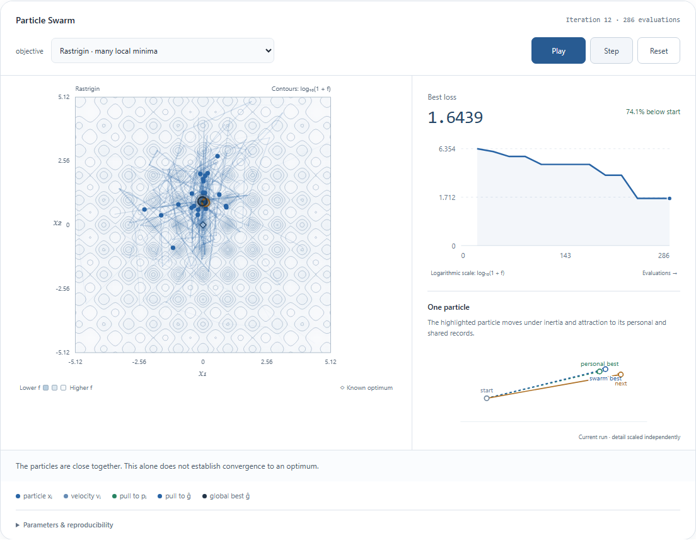
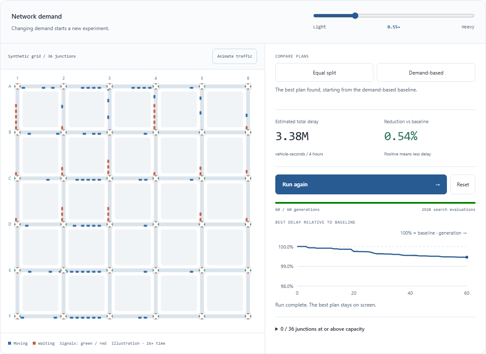

<div align="center">

# without a gradient

### *Optimising a function you cannot differentiate.*

Interactive notes on black-box optimisation, with a NumPy library and a
traffic-signal application developed from the Delta 2026 competition.

**[Optimisation methods](https://rubendahan.github.io/without-a-gradient/)** ·
**[Traffic simulation](https://rubendahan.github.io/without-a-gradient/delta/)**


<a href="https://rubendahan.github.io/without-a-gradient/">
  
</a>

</div>

## Interactive methods

The site covers particle swarm optimisation, genetic algorithms, differential
evolution, simulated annealing, CMA-ES and Bayesian optimisation. A separate
example follows thirteen gradient descents, with animated trajectories and a
loss curve for each starting point.

Each method pairs a running simulation with its loss curve. **Play** runs the
search, **Step** advances one iteration, and **Reset** repeats the same seeded
run. The small figure beside the loss shows an operation from the current run.
Parameters and mathematical details are available below each experiment.

The browser implementations are in `web/js/`. They run locally, without a backend.
The test functions make the methods visible; they are not a performance ranking.

## Traffic signals

<div align="center">
<a href="https://rubendahan.github.io/without-a-gradient/delta/">
  
</a>
</div>

The traffic page compares equal green times, demand-based allocation and particle
swarm optimisation on a synthetic network of 36 junctions. Change the demand,
compare the plans and follow the loss during the search.

The score comes from an analytical delay model. The animated cars illustrate the
signal plan but do not calculate that score. This is not the official Delta
simulator. See [delta/README.md](delta/README.md) for the model and Python package.

## Run locally

Use Node.js 22.12 or later. From the repository root:

```bash
npm run dev
```

The methods page is at <http://localhost:5173>. It reloads when source files change.
Serve it over HTTP; opening `web/index.html` directly will not load the modules.

For the traffic page, open a second terminal:

```bash
cd delta/web
npm ci
npm run dev -- --port 5174
```

The **Traffic lab** link in the local methods page opens this server. Its direct
address is <http://localhost:5174/without-a-gradient/delta/>.

## Python library

Requires Python 3.9 or later.

```bash
python -m pip install -e ".[dev]"
```

```python
from metaheuristics import Bounds, ParticleSwarm
from metaheuristics.benchmarks import rastrigin

bounds = Bounds(-5.12, 5.12, dim=10)
result = ParticleSwarm().minimize(rastrigin, bounds, seed=0)
print(result.best_f, result.best_x, result.n_evals)
```

The same interface is available for `MultiSwarm`, `GeneticAlgorithm`,
`DifferentialEvolution`, `SimulatedAnnealing`, `HillClimbing`, `CMAES` and
`BayesianOptimization`.

Run `python examples/compare_optimizers.py` to compare the implementations on the
included benchmarks. The script uses different evaluation counts across methods;
read those counts alongside the objective values.

## Checks

From the repository root:

```bash
npm test
python -m pytest
npm run build --prefix delta/web
npm run lint --prefix delta/web
```

## Repository

- `web/`: interactive methods page, canvas rendering and JavaScript optimisers.
- `metaheuristics/`: NumPy implementations and shared optimisation API.
- `tests/`: Python tests and browser-algorithm regression tests.
- `examples/`: benchmark and convergence scripts.
- `delta/`: traffic model, Python solver and React application.
- `docs/`: algorithm notes, API documentation and benchmark results.

Pushes to `main` build both pages and publish them through GitHub Pages.

## License

[MIT](LICENSE).
